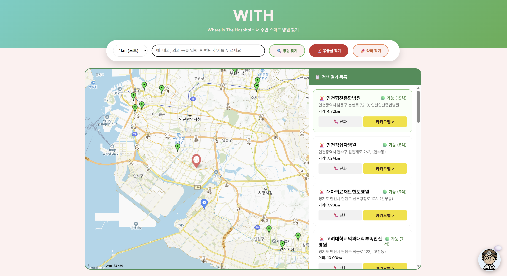
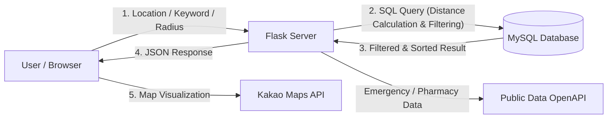

# 🏥 WITH (Where Is The Hospital)

> **사용자 위치 기반 병원·약국·응급실 조회 웹 응용** > 데이터베이스 설계와 SQL 기반 검색 로직을 중심으로 구현한 프로젝트입니다.




## 🎥 시연 영상
[▶️ 시연 영상 보러가기](https://youtu.be/ZxwgOmNNucE)

---

## 📌 프로젝트 목적


본 프로젝트는 단순히 시각적인 화면을 구성하는 것을 넘어, **데이터베이스를 효과적으로 설계하고 활용하는 웹 응용을 제작하는 것**을 핵심 목표로 합니다.

#### 1. 사회적 문제 해결 (Social Mission)
최근 사회적 문제로 대두된 **'응급실 뺑뺑이'**는 데이터가 없어서가 아니라, 필요한 데이터를 필요한 순간에 빠르게 찾지 못해 발생합니다. 본 프로젝트는 이러한 문제의식을 바탕으로, 절박한 상황에서 가장 가까운 의료기관을 신속하고 정확하게 찾아줌으로써 단순한 편의성을 넘어 생명을 구하는 데 기여할 수 있는 **골든타임 확보에 기여**하고자 기획되었습니다.

#### 2. 기술적 최적화 (Technical Mission)
공공 의료 데이터를 데이터베이스로 구조화하고, 위치 정보·반경 조건·진료과목 필터링 등을 **애플리케이션 단이 아닌 SQL 질의 수준에서 직접 처리**하도록 설계하였습니다. 이를 통해 웹 응용에서 DBMS가 어떻게 성능 최적화와 효율적인 의사결정에 기여할 수 있는지를 실제 구현을 통해 입증하였습니다.


---

## 🎯 주요 기능

### 1. 위치 기반 의료기관 검색
- **병원 검색:** 사용자 현재 위치(GPS) 기준 반경 1/3/5/10km 필터링
- **응급실 검색:** 반경 20km 이내 응급실 조회 및 거리순 정렬 (OpenAPI 연동)
- **약국 검색:** 카카오 Local API를 활용한 주변 약국 조회

### 2. 상세 검색 및 정보 제공
- **키워드 검색:** 병원명 및 진료과목(예: 내과, 정형외과) 기반 `LIKE` 검색
- **지도 시각화:** 병원/약국/응급실 유형별 마커 구분 및 클러스터링
- **상세 정보:** 병원명, 주소, 전화번호, 총 의사 수 정보 제공
- **즉시 연결:** 응급실 전화 바로 걸기 기능 제공

### 3. 사용자 보조 기능 (AI)
- **증상 기반 진료과 추천:** 사용자가 "배가 너무 아파"라고 입력하면, OpenAI LLM이 적절한 진료과(내과 등)를 추천하여 검색을 보조

---
## 🏗 시스템 아키텍처 (System Architecture)

본 서비스는 애플리케이션의 연산 부하를 최소화하고 데이터베이스의 처리 능력을 극대화하는 구조로 설계되었습니다.


---

## 🗄 데이터베이스 설계 (핵심)

본 프로젝트는 대량의 병원 데이터를 효율적으로 조회하기 위해 다음과 같은 DB 전략을 사용했습니다.

- **데이터 정제:** 공공데이터(CSV)를 전처리하여 MySQL 테이블(`hospitals`)로 적재
- **공간 데이터 처리:** 위도(`y_pos`), 경도(`x_pos`) 컬럼을 활용한 거리 계산 로직 구현
- **SQL 최적화:**
  - `Haversine Formula`를 SQL에 적용하여 DB 수준에서 거리 계산 및 필터링 (`HAVING` 절 활용)
  - 좌표 컬럼(`y_pos`, `x_pos`)에 복합 인덱스를 적용하여 조회 속도 향상
  - 부동소수점 연산 오차 방지를 위해 `LEAST` / `GREATEST` 함수 활용 (Clamping)

---

## ⚡ Troubleshooting Log

**Issue: 거리 계산 속도 저하 문제**
초기에 Python 애플리케이션 내부에서 모든 병원 목록(`SELECT *`)을 가져온 뒤 반복문(`for`)으로 거리를 계산했더니, 데이터가 많아질수록 응답 속도가 현저히 느려지는 병목 현상이 발생함.

**Solution: 연산 로직의 DB 이관**
거리 계산 로직(Haversine Formula)을 SQL 쿼리에 직접 포함시켜, DB 엔진이 계산하고 거리순 정렬(`ORDER BY`)까지 마친 후 필요한 데이터(Limit 50)만 반환하도록 수정함.
-> **결과적으로 응답 속도 단축 및 메모리 사용량 감소.**

---

## 🚧 한계점 및 향후 과제 (Future Work)

- **실시간 운영 정보 미제공:** 현재는 병원의 위치 정보만 제공하지만, 추후 요일별/시간별 진료 시간 데이터를 DB에 추가하여 **"현재 진료 중"**, **"진료 마감"** 상태를 실시간으로 표시하는 기능을 개발할 예정임.
- **길찾기 기능 부재:** 현재는 위치 확인만 가능하나, 향후 카카오 내비게이션 API 등을 연동하여 버튼 클릭 시 **현재 위치에서 병원까지의 도보/차량 경로를 바로 안내**하는 기능을 추가하여 긴급 상황 대응력을 높이고자 함.

---

## 🛠 개발 환경

- **Backend:** Python 3.10, Flask
- **Frontend:** HTML5, CSS3, JavaScript
- **Database:** MySQL 8.0
- **External APIs:**
  - Kakao Maps API (지도 시각화)
  - Kakao Local API (키워드 검색)
  - 공공데이터포털 OpenAPI (응급실 정보)
  - OpenAI API (챗봇 기능)
- **IDE:** VS Code, MySQL Workbench

---

## 📂 프로젝트 구조

```bash
WITH-Where-Is-The-Hospital/
├── app.py                # Flask 메인 애플리케이션
├── config.py             # 환경 설정 (API Key)
├── database/
│   └── schema.sql        # DB 스키마 생성 SQL
├── static/               # 정적 파일 (CSS, JS)
├── templates/            # HTML 템플릿
│   ├── index.html        # 메인 지도 화면
│   └── chat.html         # 챗봇 화면
├── requirements.txt      # 의존성 라이브러리 목록
└── README.md             # 프로젝트 설명서
```

---


## ✅ 결론 (Conclusion)

특히 응급실 검색 기능은 의료기관 탐색 지연으로 인한 골든타임 손실 문제를 완화하고자 기획되었다.
이를 통해 데이터베이스 중심 설계가 단순한 '데이터 저장소'를 넘어, **시스템의 성능을 결정짓는 핵심 연산 장치**가 될 수 있음을 깊이 이해했습니다.
